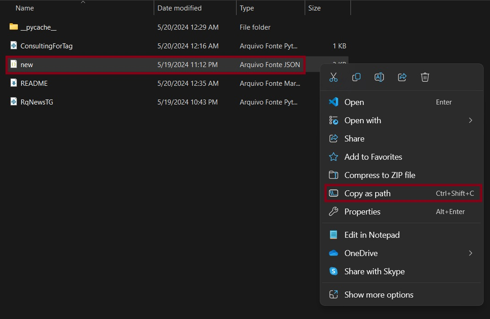
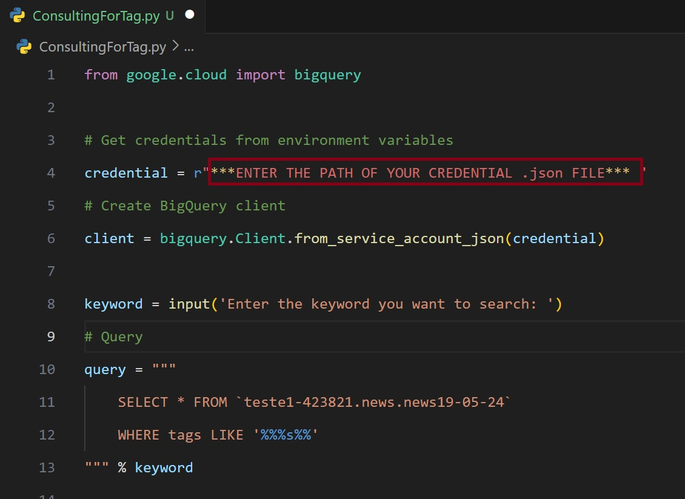

# Coding-Challenge-Lima 💻

## Details

- Write an application to crawl an online news website, e.g. www.theguardian.com/ or www.bbc.com using a crawler framework such as [Scrapy] (http://scrapy.org/). You can use a crawl framework of your choice and build the application in Python;

- The appliction should cleanse the articles to obtain only information relevant to the news story, e.g. article text, author, headline, article url, etc. Use a framework such as Readability to cleanse the page of superfluous content such as advertising and html;

- Store the data in BigQuery, for subsequent search and retrieval. Ensure the URL of the article is included to enable comparison to the original.

## Bonus
- Write an API that provides access to the content in BigQuery database. The user should be able to search for articles by keyword

## Installation of the Necessary Libraries 🗃️

- pip install scrapy
- pip install --upgrade google-cloud-bigquery 

- In the ConsultingForTag.py make this changes:

    

## Guide

- Run : scrapy runspider RqNewsTG.py -O newsoftheday.csv
  *The online news site The Guardian will be crawled, filter important data and create the file "newsoftheday.csv"*

- Run : python ConsultingForTag.py
  *This will consult the file that has already been added to Google's bigquery, through the input 'Tag' provided by the user, and will return the news that matches the tag.*

